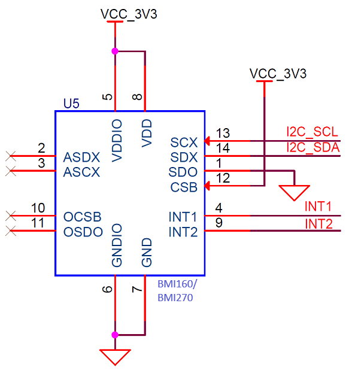
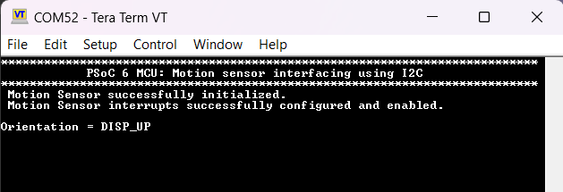

# PSoC&trade; 6 MCU: BMI160 motion sensor interfacing using I2C

This example demonstrates how to interface PSoC&trade; 6 MCU with a [BMI160 motion sensor](https://www.bosch-sensortec.com/products/motion-sensors/imus/bmi160.html) over an I2C interface within a FreeRTOS task using the [BMI160 motion sensor library](https://github.com/Infineon/sensor-motion-bmi160). This example reads the raw motion data and estimates the orientation of the board.

[View this README on GitHub.](https://github.com/Infineon/mtb-example-psoc6-bmi160-motion-sensor-freertos)

[Provide feedback on this code example.](https://cypress.co1.qualtrics.com/jfe/form/SV_1NTns53sK2yiljn?Q_EED=eyJVbmlxdWUgRG9jIElkIjoiQ0UyMzE4NjQiLCJTcGVjIE51bWJlciI6IjAwMi0zMTg2NCIsIkRvYyBUaXRsZSI6IlBTb0MmdHJhZGU7IDYgTUNVOiBCTUkxNjAgbW90aW9uIHNlbnNvciBpbnRlcmZhY2luZyB1c2luZyBJMkMiLCJyaWQiOiJzbXJ4IiwiRG9jIHZlcnNpb24iOiIyLjAuMCIsIkRvYyBMYW5ndWFnZSI6IkVuZ2xpc2giLCJEb2MgRGl2aXNpb24iOiJNQ0QiLCJEb2MgQlUiOiJJQ1ciLCJEb2MgRmFtaWx5IjoiUFNPQyJ9)

## Requirements

- [ModusToolbox&trade; software](https://www.infineon.com/modustoolbox) v3.0 or later (tested with v3.0)
- Board support package (BSP) minimum required version: 4.0.0
- Programming language: C
- Associated parts: All [PSoC&trade; 6 MCU](https://www.infineon.com/cms/en/product/microcontroller/32-bit-psoc-arm-cortex-microcontroller/psoc-6-32-bit-arm-cortex-m4-mcu)
## Supported toolchains (make variable 'TOOLCHAIN')

- GNU Arm&reg; embedded compiler v10.3.1 (`GCC_ARM`) - Default value of `TOOLCHAIN`
- Arm&reg; compiler v6.16 (`ARM`)
- IAR C/C++ compiler v9.30.1 (`IAR`)

## Supported kits (make variable 'TARGET')

- [PSoC&trade; 6 Bluetooth&reg; LE pioneer kit](https://www.infineon.com/CY8CKIT-062-BLE) (`CY8CKIT-062-BLE`) – Default value of `TARGET`
- [PSoC&trade; 6 Wi-Fi Bluetooth&reg; prototyping kit](https://www.infineon.com/CY8CPROTO-062-4343W) (`CY8CPROTO-062-4343W`)
- [PSoC&trade; 6 Wi-Fi Bluetooth&reg; pioneer kit](https://www.infineon.com/CY8CKIT-062-WIFI-BT) (`CY8CKIT-062-WIFI-BT`)
- [PSoC&trade; 6 Bluetooth&reg; LE prototyping kit](https://www.infineon.com/CY8CPROTO-063-BLE) (`CY8CPROTO-063-BLE`)
- [PSoC&trade; 62S1 Wi-Fi Bluetooth&reg; pioneer kit](https://www.infineon.com/CYW9P62S1-43438EVB-01) (`CYW9P62S1-43438EVB-01`)
- [PSoC&trade; 62S1 Wi-Fi Bluetooth&reg; pioneer kit](https://www.infineon.com/CYW9P62S1-43012EVB-01) (`CYW9P62S1-43012EVB-01`)
- [PSoC&trade; 62S2 Wi-Fi Bluetooth&reg; pioneer kit](https://www.infineon.com/CY8CKIT-062S2-43012) (`CY8CKIT-062S2-43012`)
- [PSoC&trade; 62S3 Wi-Fi Bluetooth&reg; prototyping kit](https://www.infineon.com/CY8CPROTO-062S3-4343W) (`CY8CPROTO-062S3-4343W`)
- [PSoC&trade; 62S4 pioneer kit](https://www.infineon.com/CY8CKIT-062S4) (`CY8CKIT-062S4`)
- [PSoC&trade; 64 "Secure Boot" Wi-Fi Bluetooth&reg; pioneer kit](https://www.infineon.com/CY8CKIT-064B0S2-4343W) (`CY8CKIT-064B0S2-4343W`)
- [PSoC&trade; 62S2 evaluation kit](https://www.infineon.com/CY8CEVAL-062S2) (`CY8CEVAL-062S2`, `CY8CEVAL-062S2-LAI-4373M2`)

This example requires the [BMI160 inertial measurement unit](https://www.bosch-sensortec.com/products/motion-sensors/imus/bmi160.html) to be interfaced with PSoC&trade; 6 MCU using one of the kits mentioned above.


### Interfacing details

There are primarily two ways of interfacing the BMI160 motion sensor with the PSoC&trade; 6 MCU in this code example:

1. **Shields:** [CY8CKIT-028-EPD](https://www.infineon.com/cms/en/product/evaluation-boards/cy8ckit-028-epd) or [CY8CKIT-028-TFT](https://www.infineon.com/cms/en/product/evaluation-boards/cy8ckit-028-tft) *(On some supported kits only):* You can plug in the shield to the PSoC&trade; 6 MCU kit and configure the `INTERFACE_USED` and `BMI160_INTERRUPT_CHANNEL` macros in the *motion_task.h* file as described in the [Operation](#operation) section.

   **Note:** This method of interfacing is not supported by all the kits mentioned in the [Supported kits](#supported-kits-make-variable-target) section. See **Table 1** for supported interfaces for each supported kit and the corresponding interrupt pin interfacing details.

2. **Direct connection:** Interface the BMI160 motion sensor per the schematic diagram shown in **Figure 1**.

   - Connect the *I2C_SDA* and *I2C_SCL* pins to the kit's I2C pins. See the kit user guide for more details on the kit's I2C configuration.

   - BMI160 provides two interrupt channels (*INT1* and *INT2*) to which various interrupt events can be assigned. Connect either *INT1* or *INT2* pin with a PSoC&trade; 6 MCU GPIO pin, define the `INTERFACE_USED` macro as `CUSTOM_INTERFACE`, and configure the `BMI160_INTERRUPT_CHANNEL` and `CUSTOM_INTERRUPT_PIN` macros as described in the [Operation](#operation) section.

     **Figure 1. BMI160 custom interfacing diagram**

     

**Table 1** lists the supported interfaces for each supported kit and the corresponding interrupt pin interfacing details. Note that for the functionality of this code example, you need to use only one of the BMI160's interrupt pins (either INT1 or INT2, not both).

- In case of shields (CY8CKIT-028-EPD and CY8CKIT-028-TFT), the PSoC&trade; 6 GPIO pins that connect to the BMI160's INT1 and INT2 pins are also shown in **Table 1**. The code example automatically configures these GPIO pins when you define the `INTERFACE_USED` macro and the details in the table are for your information only.

- In case of direct interfacing ('CUSTOM_INTERFACE'), you should choose an appropriate GPIO pin to interface INT1 or INT2 (mentioned as *User-defined* in the following table).

**Table 1. BMI160 and PSoC&trade; 6 MCU interfacing**

| Development kit | Supported interfaces (`INTERFACE_USED` macro) | PSoC&trade; 6 MCU GPIO pin interfaced with BMI160's INT1 pin | PSoC&trade; 6 MCU GPIO pin interfaced with BMI160's INT2 pin |
| :-------------- | :--------------------- | :-------------------------- | :------------------------ |
| CY8CKIT-062-BLE | CY8CKIT_028_EPD <br> CY8CKIT_028_TFT <br> CUSTOM_INTERFACE | P13[1] <br> P10[2] <br> User-defined | P13[0] <br> P10[3] <br> User-defined |
| CY8CPROTO-062-4343W | CUSTOM_INTERFACE | User-defined | User-defined |
| CY8CKIT-062-WiFi-BT | CY8CKIT_028_EPD <br> CY8CKIT_028_TFT <br> CUSTOM_INTERFACE | P13[1] <br> P10[2] <br> User-defined | P13[0] <br> P10[3] <br> User-defined |
| CY8CPROTO-063-BLE | CUSTOM_INTERFACE | User-defined | User-defined |
| CY8CKIT-062S2-43012 | CY8CKIT_028_EPD <br> CY8CKIT_028_TFT <br> CUSTOM_INTERFACE | P7[6] <br> P10[2] <br> User-defined | P7[5] <br> P10[3] <br> User-defined |
| CYW9P62S1-43438EVB-01 | CY8CKIT_028_EPD <br> CY8CKIT_028_TFT <br> CUSTOM_INTERFACE | P7[4] <br> P10[2] <br> User-defined | P7[5] <br> P10[3] <br> User-defined |
| CYW9P62S1-43012EVB-01 | CY8CKIT_028_TFT <br> CUSTOM_INTERFACE | P6[4] <br> User-defined | P6[5] <br> User-defined |
| CY8CPROTO-062S3-4343W | CUSTOM_INTERFACE | User-defined | User-defined |
| CY8CKIT-064B0S2-4343W | CY8CKIT_028_EPD <br> CY8CKIT_028_TFT <br> CUSTOM_INTERFACE | P7[6] <br> P10[2] <br> User-defined | P7[5] <br> P10[3] <br> User-defined |
| CY8CEVAL-062S2 | CY8CKIT_028_EPD <br> CY8CKIT_028_TFT <br> CUSTOM_INTERFACE | P7[6] <br> P10[2] <br> User-defined | P0[5] <br> P10[3] <br> User-defined |
| CY8CEVAL-062S2-LAI-4373M2 | CY8CKIT_028_EPD <br> CY8CKIT_028_TFT <br> CUSTOM_INTERFACE | P7[6] <br> P10[2] <br> User-defined | P0[5] <br> P10[3] <br> User-defined |

<br>

This example uses the board's default configuration. See the kit user guide to ensure that the board is configured correctly.

**Notes:**

- The PSoC&trade; 62S1 Wi-Fi Bluetooth&reg; pioneer kit (CYW9P62S1-43012EVB-01) cannot be used with the CY8CKIT-028-EPD shield to evaluate the complete functionality of this example. This is because this kit does not have any GPIO connections to the D8 and D9 pins compatible with Arduino to which the motion sensor's interrupt pins interface on the CY8CKIT-028-EPD shield.

- The PSoC&trade; 6 Bluetooth&reg; LE pioneer kit (CY8CKIT-062-BLE) and the PSoC&trade; 6 Wi-Fi Bluetooth&reg; pioneer kit (CY8CKIT-062-WIFI-BT) ship with KitProg2 installed. The ModusToolbox&trade; software requires KitProg3. Before using this code example, make sure that the board is upgraded to KitProg3. The tool and instructions are available in the [firmware loader](https://github.com/Infineon/Firmware-loader) GitHub repository. If you do not upgrade, you will see an error like "unable to find CMSIS-DAP device" or "KitProg firmware is out of date".

## Software setup

Install a terminal emulator if you don't have one. Instructions in this document use [Tera Term](https://ttssh2.osdn.jp/index.html.en).

This example requires no additional software or tools.

## Using the code example

Create the project and open it using one of the following:

<details><summary><b>In Eclipse IDE for ModusToolbox&trade; software</b></summary>

1. Click the **New Application** link in the **Quick Panel** (or, use **File** > **New** > **ModusToolbox&trade; Application**). This launches the [Project Creator](https://www.infineon.com/ModusToolboxProjectCreator) tool.

2. Pick a kit supported by the code example from the list shown in the **Project Creator - Choose Board Support Package (BSP)** dialog.

   When you select a supported kit, the example is reconfigured automatically to work with the kit. To work with a different supported kit later, use the [Library Manager](https://www.infineon.com/ModusToolboxLibraryManager) to choose the BSP for the supported kit. You can use the Library Manager to select or update the BSP and firmware libraries used in this application. To access the Library Manager, click the link from the **Quick Panel**.

   You can also just start the application creation process again and select a different kit.

   If you want to use the application for a kit not listed here, you may need to update the source files. If the kit does not have the required resources, the application may not work.

3. In the **Project Creator - Select Application** dialog, choose the example by enabling the checkbox.

4. (Optional) Change the suggested **New Application Name**.

5. The **Application(s) Root Path** defaults to the Eclipse workspace which is usually the desired location for the application. If you want to store the application in a different location, you can change the *Application(s) Root Path* value. Applications that share libraries should be in the same root path.

6. Click **Create** to complete the application creation process.

For more details, see the [Eclipse IDE for ModusToolbox&trade; software user guide](https://www.infineon.com/MTBEclipseIDEUserGuide) (locally available at *{ModusToolbox&trade; software install directory}/docs_{version}/mt_ide_user_guide.pdf*).

</details>

<details><summary><b>In command-line interface (CLI)</b></summary>

ModusToolbox&trade; software provides the Project Creator as both a GUI tool and the command line tool, "project-creator-cli". The CLI tool can be used to create applications from a CLI terminal or from within batch files or shell scripts. This tool is available in the *{ModusToolbox&trade; software install directory}/tools_{version}/project-creator/* directory.

Use a CLI terminal to invoke the "project-creator-cli" tool. On Windows, use the command line "modus-shell" program provided in the ModusToolbox&trade; software installation instead of a standard Windows command-line application. This shell provides access to all ModusToolbox&trade; software tools. You can access it by typing `modus-shell` in the search box in the Windows menu. In Linux and macOS, you can use any terminal application.

The "project-creator-cli" tool has the following arguments:

Argument | Description | Required/optional
---------|-------------|-----------
`--board-id` | Defined in the `<id>` field of the [BSP](https://github.com/Infineon?q=bsp-manifest&type=&language=&sort=) manifest | Required
`--app-id`   | Defined in the `<id>` field of the [CE](https://github.com/Infineon?q=ce-manifest&type=&language=&sort=) manifest | Required
`--target-dir`| Specify the directory in which the application is to be created if you prefer not to use the default current working directory | Optional
`--user-app-name`| Specify the name of the application if you prefer to have a name other than the example's default name | Optional

<br>

The following example clones the "[mtb-example-psoc6-bmi160-motion-sensor-freertos](https://github.com/Infineon/mtb-example-psoc6-bmi160-motion-sensor-freertos)" application with the desired name "Bmi160Freertos" configured for the *CY8CKIT-062-WIFI-BT* BSP into the specified working directory, *C:/mtb_projects*:

   ```
   project-creator-cli --board-id CY8CKIT-062-WIFI-BT --app-id mtb-example-psoc6-bmi160-motion-sensor-freertos --user-app-name Bmi160Freertos --target-dir "C:/mtb_projects"
   ```

**Note:** The project-creator-cli tool uses the `git clone` and `make getlibs` commands to fetch the repository and import the required libraries. For details, see the "Project creator tools" section of the [ModusToolbox&trade; software user guide](https://www.infineon.com/ModusToolboxUserGuide) (locally available at *{ModusToolbox&trade; software install directory}/docs_{version}/mtb_user_guide.pdf*).

To work with a different supported kit later, use the [Library Manager](https://www.infineon.com/ModusToolboxLibraryManager) to choose the BSP for the supported kit. You can invoke the Library Manager GUI tool from the terminal using `make library-manager` command or use the Library Manager CLI tool "library-manager-cli" to change the BSP.

The "library-manager-cli" tool has the following arguments:

Argument | Description | Required/optional
---------|-------------|-----------
`--add-bsp-name` | Name of the BSP that should be added to the application | Required
`--set-active-bsp` | Name of the BSP that should be as active BSP for the application | Required
`--add-bsp-version`| Specify the version of the BSP that should be added to the application if you do not wish to use the latest from manifest | Optional
`--add-bsp-location`| Specify the location of the BSP (local/shared) if you prefer to add the BSP in a shared path | Optional

<br>

Following example adds the CY8CPROTO-062-4343W BSP to the already created application and makes it the active BSP for the app:

   ```
   library-manager-cli --project "C:/mtb_projects/MyHelloWorld" --add-bsp-name CY8CPROTO-062-4343W --add-bsp-version "latest-v4.X" --add-bsp-location "local"

   library-manager-cli --project "C:/mtb_projects/MyHelloWorld" --set-active-bsp APP_CY8CPROTO-062-4343W
   ```

</details>

<details><summary><b>In third-party IDEs</b></summary>

Use one of the following options:

- **Use the standalone [Project Creator](https://www.infineon.com/ModusToolboxProjectCreator) tool:**

   1. Launch Project Creator from the Windows Start menu or from *{ModusToolbox&trade; software install directory}/tools_{version}/project-creator/project-creator.exe*.

   2. In the initial **Choose Board Support Package** screen, select the BSP, and click **Next**.

   3. In the **Select Application** screen, select the appropriate IDE from the **Target IDE** drop-down menu.

   4. Click **Create** and follow the instructions printed in the bottom pane to import or open the exported project in the respective IDE.

<br>

- **Use command-line interface (CLI):**

   1. Follow the instructions from the **In command-line interface (CLI)** section to create the application.

   2. Export the application to a supported IDE using the `make <ide>` command.

   3. Follow the instructions displayed in the terminal to create or import the application as an IDE project.

For a list of supported IDEs and more details, see the "Exporting to IDEs" section of the [ModusToolbox&trade; software user guide](https://www.infineon.com/ModusToolboxUserGuide) (locally available at *{ModusToolbox&trade; software install directory}/docs_{version}/mtb_user_guide.pdf*).

</details>

## Operation

If using a PSoC&trade; 64 "Secure" MCU kit (like CY8CKIT-064B0S2-4343W), the PSoC&trade; 64 device must be provisioned with keys and policies before being programmed. Follow the instructions in the ["Secure Boot" SDK user guide](https://www.infineon.com/dgdlac/Infineon-PSoC_64_Secure_MCU_Secure_Boot_SDK_User_Guide-Software-v07_00-EN.pdf?fileId=8ac78c8c7d0d8da4017d0f8c361a7666) to provision the device. If the kit is already provisioned, copy-paste the keys and policy folder to the application folder.

1. Interface the BMI160 motion sensor with the kit. See the [Hardware setup](#hardware-setup) section for the interfacing details.

2. Connect the board to your PC using the provided USB cable through the KitProg3 USB connector.

3. Open a terminal program and select the KitProg3 COM port. Set the serial port parameters to 8N1 and 115200 baud.

4. Specify the BMI160 motion sensor configuration details in the *motion_task.h* file as follows:

   1. Modify the `INTERFACE_USED` macro based on how you interface the motion sensor. To know the interfaces supported with your kit, see **Table 1**. For the shields, define the macro as `CY8CKIT_028_EPD` or `CY8CKIT_028_TFT`. If you connect the sensor directly with the PSoC&trade; 6 MCU, define the macro as `CUSTOM_INTERFACE`.

      **Note:** If you use a kit that is not a pioneer kit (pioneer kits have headers compatible with Arduino), choose `CUSTOM_INTERFACE` for this macro.

   2. Specify the interrupt channel (1 or 2) of the BMI160 motion sensor that you want to use in this example using the `BMI160_INTERRUPT_CHANNEL` macro. By default, this macro is set to '1', which corresponds to the INT1 pin.

   3. If you use a custom interface (`INTERFACE_USED` defined as `CUSTOM_INTERFACE`), specify the GPIO pin of PSoC&trade; 6 MCU that interfaces with the BMI160 motion sensor's interrupt pin (INT1 when `BMI160_INTERRUPT_CHANNEL` is 1; INT2 when the macro is 2) by using the `CUSTOM_INTERRUPT_PIN` macro.

      Example:
      ```
      #define CUSTOM_INTERRUPT_PIN      (P10_0)
      ```

5. Program the board using one of the following:

   <details><summary><b>Using Eclipse IDE for ModusToolbox&trade; software</b></summary>

      1. Select the application project in the Project Explorer.

      2. In the **Quick Panel**, scroll down, and click **\<Application Name> Program (KitProg3_MiniProg4)**.
   </details>

   <details><summary><b>Using CLI</b></summary>

     From the terminal, execute the `make program` command to build and program the application using the default toolchain to the default target. The default toolchain is specified in the application's Makefile but you can override this value manually:
      ```
      make program TOOLCHAIN=<toolchain>
      ```

      Example:
      ```
      make program TOOLCHAIN=GCC_ARM
      ```
   </details>

6. After programming, the application starts automatically. Confirm that the terminal application displays the code example title and the initial orientation.

   **Figure 2. Terminal showing the initial orientation**

   

   **Note:** If the terminal displays an error message, check the connection of the motion sensor or EPD/TFT shield with the kit.

   The accelerometer sensor data is used to estimate the board’s spatial orientation. The terminal application display shows one of the six orientation states: *DISP_UP, DISP_DOWN, TOP_EDGE, BOTTOM_EDGE, LEFT_EDGE, and RIGHT_EDGE*. Side views of the pioneer kit with the EPD shield for each orientation state are shown as follows.

   **Figure 3. Orientation states**

   

7. Change the orientation of the motion sensor and confirm that the orientation is updated on the same line in the terminal application as illustrated as follows.

   **Figure 4. Terminal output for orientation states**

   


## Debugging

You can debug the example to step through the code. In the IDE, use the **\<Application Name> Debug (KitProg3_MiniProg4)** configuration in the **Quick Panel**. For details, see the "Program and debug" section in the [Eclipse IDE for ModusToolbox&trade; software user guide](https://www.infineon.com/MTBEclipseIDEUserGuide).

**Note:** **(Only while debugging)** On the CM4 CPU, some code in `main()` may execute before the debugger halts at the beginning of `main()`. This means that some code executes twice – once before the debugger stops execution, and again after the debugger resets the program counter to the beginning of `main()`. See [KBA231071](https://community.infineon.com/t5/Knowledge-Base-Articles/PSoC-6-MCU-Code-in-main-executes-before-the-debugger-halts-at-the-first-line-of/ta-p/253856) to learn about this and for the workaround.


## Design and implementation

[BMI160 motion sensor](https://www.bosch-sensortec.com/products/motion-sensors/imus/bmi160.html) is a low-power inertial measurement unit (IMU) providing 3-axis acceleration and 3-axis gyroscopic measurements. It is present on both the E-INK display shield (CY8CKIT-028-EPD) and the TFT display shield (CY8CKIT-028-TFT). PSoC&trade; 6 MCU interfaces with this sensor and reads the accelerometer data from which the orientation is computed and displayed on the terminal application.

The BMI160 motion sensor is interfaced with PSoC&trade; 6 MCU using an I2C interface and up to two interrupt pins. BMI160 has a hardware-selectable I2C slave address, depending on the logic driven on the SDO pin. On the EPD and TFT shields, the SDO pin is pulled to GND, which selects the slave address 0b1101000 (0x68).

BMI160 provides two interrupt channels (INT1 and INT2) to which various interrupt events can be assigned. In this example, the orientation interrupt is assigned to the interrupt pin that is configured using the `BMI160_INTERRUPT_CHANNEL` macro. See the [BMI160 datasheet](https://www.bosch-sensortec.com/products/motion-sensors/imus/bmi160.html) for details on interrupt outputs.

The BMI160 motion sensor's interrupt output (INT1 or INT2 based on the `BMI160_INTERRUPT_CHANNEL` macro) is configured to provide a rising-edge signal with a pulse width of 5 ms. The motion sensor is configured to provide an interrupt when the orientation is changed. Raw accelerometer data is read and processed on the orientation interrupt to compute the orientation.

On PSoC&trade; 6 MCU, the GPIO pin connected to the motion sensor's interrupt pin (INT1 or INT2 based on the `BMI160_INTERRUPT_CHANNEL` macro) is configured as an input pin to detect rising-edge interrupts. The GPIO pin is automatically chosen by the example depending upon the combination of the kit, shield, and the interrupt channel being used. The shield (or custom interface) being used and the desired interrupt channel to be used can be configured in the *motion_task.h* file as described earlier.


### Code example execution

The main function initializes the BSP and the retarget-io library, and creates the motion sensor task. The task initializes the motion sensor and configures the interrupt. The task reads the accelerometer data, computes the orientation, displays it on the UART console, and then waits indefinitely for a task notification. Upon receiving an interrupt from the motion sensor, the ISR is invoked which notifies the motion sensor task. Then, the task reads the motion sensor data, updates the orientation state, and waits for the notification again. This operation continues indefinitely.


### Resources and settings

An SCB-based resource in I2C mode is configured with the help of I2C HAL APIs to implement the I2C master interface to BMI160. The I2C clock frequency is set to 1 MHz. Configuration of the motion sensor and acquiring the accelerometer information are performed over this interface.

**Table 2. Application resources**

 Resource  |  Alias/object     |    Purpose
 :-------- | :-------------    | :------------
 SCB (I2C) (HAL) | kit_i2c                 | I2C master driver to communicate with the BMI160 motion sensor
 UART (HAL)      | cy_retarget_io_uart_obj | UART HAL object used by retarget-io for the debug UART port
 GPIO (HAL)      | BMI160_INTERRUPT_PIN    | Motion sensor interrupt pin

<br>

## Related resources


Resources  | Links
-----------|----------------------------------
Application notes  | [AN228571](https://www.infineon.com/AN228571) – Getting started with PSoC&trade; 6 MCU on ModusToolbox&trade; software <br>  [AN215656](https://www.infineon.com/AN215656) – PSoC&trade; 6 MCU: Dual-CPU system design <br>  [AN85951](https://www.infineon.com/AN85951) – PSoC&trade; 4 and PSoC&trade; 6 MCU CAPSENSE&trade; design guide
Code examples  | [Using ModusToolbox&trade; software](https://github.com/Infineon/Code-Examples-for-ModusToolbox-Software) on GitHub
Device documentation | [PSoC&trade; 6 MCU datasheets](https://www.infineon.com/cms/en/search.html#!view=downloads&term=psoc6&doc_group=Data%20Sheet) <br> [PSoC&trade; 6 technical reference manuals](https://www.infineon.com/cms/en/search.html#!view=downloads&term=psoc6&doc_group=Additional%20Technical%20Information)
Development kits | Select your kits from the [evaluation board finder](https://www.infineon.com/cms/en/design-support/finder-selection-tools/product-finder/evaluation-board).
Libraries on GitHub  | [mtb-pdl-cat1](https://github.com/Infineon/mtb-pdl-cat1) – PSoC&trade; 6 peripheral driver library (PDL)  <br> [mtb-hal-cat1](https://github.com/Infineon/mtb-hal-cat1) – Hardware abstraction layer (HAL) library <br> [retarget-io](https://github.com/Infineon/retarget-io) – Utility library to retarget STDIO messages to a UART port <br> [freeRTOS](https://github.com/Infineon/freertos) – A port of FreeRTOS kernel for PSoC&trade; 6 and PSoC&trade; 4 MCUs <br> [sensor-motion-bmi160](https://github.com/Infineon/sensor-motion-bmi160) – BMI160 inertial measurement unit (motion sensor) library
Middleware on GitHub  | [capsense](https://github.com/Infineon/capsense) – CAPSENSE&trade; library and documents <br> [psoc6-middleware](https://github.com/Infineon/modustoolbox-software#psoc-6-middleware-libraries) – Links to all PSoC&trade; 6 MCU middleware
Tools  | [Eclipse IDE for ModusToolbox&trade; software](https://www.infineon.com/cms/en/design-support/tools/sdk/modustoolbox-software/) – ModusToolbox&trade; software is a collection of easy-to-use software and tools enabling rapid development with Infineon MCUs, covering applications from embedded sense and control to wireless and cloud-connected systems using AIROC&trade; Wi-Fi and Bluetooth® connectivity devices.

<br>

## Other resources

Infineon provides a wealth of data at www.infineon.com to help you select the right device, and quickly and effectively integrate it into your design.

For PSoC&trade; 6 MCU devices, see [How to design with PSoC&trade; 6 MCU – KBA223067](https://community.infineon.com/t5/Knowledge-Base-Articles/How-to-Design-with-PSoC-6-MCU-KBA223067/ta-p/248857) in the Infineon community.


## Document history

Document title: *CE231864* – *PSoC&trade; 6 MCU: BMI160 motion sensor interfacing using I2C*

 Version | Description of change
 ------- | ---------------------
 1.0.0   | New code example
 1.1.0   | Added support for new kits
 2.0.0   | Major update to support ModusToolbox&trade; software v3.0 and BSPs v4.X<br>This version is not backward compatible with previous versions of ModusToolbox&trade;

<br>

---------------------------------------------------------

© Cypress Semiconductor Corporation, 2020-2022. This document is the property of Cypress Semiconductor Corporation, an Infineon Technologies company, and its affiliates ("Cypress").  This document, including any software or firmware included or referenced in this document ("Software"), is owned by Cypress under the intellectual property laws and treaties of the United States and other countries worldwide.  Cypress reserves all rights under such laws and treaties and does not, except as specifically stated in this paragraph, grant any license under its patents, copyrights, trademarks, or other intellectual property rights.  If the Software is not accompanied by a license agreement and you do not otherwise have a written agreement with Cypress governing the use of the Software, then Cypress hereby grants you a personal, non-exclusive, nontransferable license (without the right to sublicense) (1) under its copyright rights in the Software (a) for Software provided in source code form, to modify and reproduce the Software solely for use with Cypress hardware products, only internally within your organization, and (b) to distribute the Software in binary code form externally to end users (either directly or indirectly through resellers and distributors), solely for use on Cypress hardware product units, and (2) under those claims of Cypress’s patents that are infringed by the Software (as provided by Cypress, unmodified) to make, use, distribute, and import the Software solely for use with Cypress hardware products.  Any other use, reproduction, modification, translation, or compilation of the Software is prohibited.
<br>
TO THE EXTENT PERMITTED BY APPLICABLE LAW, CYPRESS MAKES NO WARRANTY OF ANY KIND, EXPRESS OR IMPLIED, WITH REGARD TO THIS DOCUMENT OR ANY SOFTWARE OR ACCOMPANYING HARDWARE, INCLUDING, BUT NOT LIMITED TO, THE IMPLIED WARRANTIES OF MERCHANTABILITY AND FITNESS FOR A PARTICULAR PURPOSE.  No computing device can be absolutely secure.  Therefore, despite security measures implemented in Cypress hardware or software products, Cypress shall have no liability arising out of any security breach, such as unauthorized access to or use of a Cypress product. CYPRESS DOES NOT REPRESENT, WARRANT, OR GUARANTEE THAT CYPRESS PRODUCTS, OR SYSTEMS CREATED USING CYPRESS PRODUCTS, WILL BE FREE FROM CORRUPTION, ATTACK, VIRUSES, INTERFERENCE, HACKING, DATA LOSS OR THEFT, OR OTHER SECURITY INTRUSION (collectively, "Security Breach").  Cypress disclaims any liability relating to any Security Breach, and you shall and hereby do release Cypress from any claim, damage, or other liability arising from any Security Breach.  In addition, the products described in these materials may contain design defects or errors known as errata which may cause the product to deviate from published specifications. To the extent permitted by applicable law, Cypress reserves the right to make changes to this document without further notice. Cypress does not assume any liability arising out of the application or use of any product or circuit described in this document. Any information provided in this document, including any sample design information or programming code, is provided only for reference purposes.  It is the responsibility of the user of this document to properly design, program, and test the functionality and safety of any application made of this information and any resulting product.  "High-Risk Device" means any device or system whose failure could cause personal injury, death, or property damage.  Examples of High-Risk Devices are weapons, nuclear installations, surgical implants, and other medical devices.  "Critical Component" means any component of a High-Risk Device whose failure to perform can be reasonably expected to cause, directly or indirectly, the failure of the High-Risk Device, or to affect its safety or effectiveness.  Cypress is not liable, in whole or in part, and you shall and hereby do release Cypress from any claim, damage, or other liability arising from any use of a Cypress product as a Critical Component in a High-Risk Device. You shall indemnify and hold Cypress, including its affiliates, and its directors, officers, employees, agents, distributors, and assigns harmless from and against all claims, costs, damages, and expenses, arising out of any claim, including claims for product liability, personal injury or death, or property damage arising from any use of a Cypress product as a Critical Component in a High-Risk Device. Cypress products are not intended or authorized for use as a Critical Component in any High-Risk Device except to the limited extent that (i) Cypress’s published data sheet for the product explicitly states Cypress has qualified the product for use in a specific High-Risk Device, or (ii) Cypress has given you advance written authorization to use the product as a Critical Component in the specific High-Risk Device and you have signed a separate indemnification agreement.
<br>
Cypress, the Cypress logo, and combinations thereof, WICED, ModusToolbox, PSoC, CapSense, EZ-USB, F-RAM, and Traveo are trademarks or registered trademarks of Cypress or a subsidiary of Cypress in the United States or in other countries. For a more complete list of Cypress trademarks, visit cypress.com. Other names and brands may be claimed as property of their respective owners.
